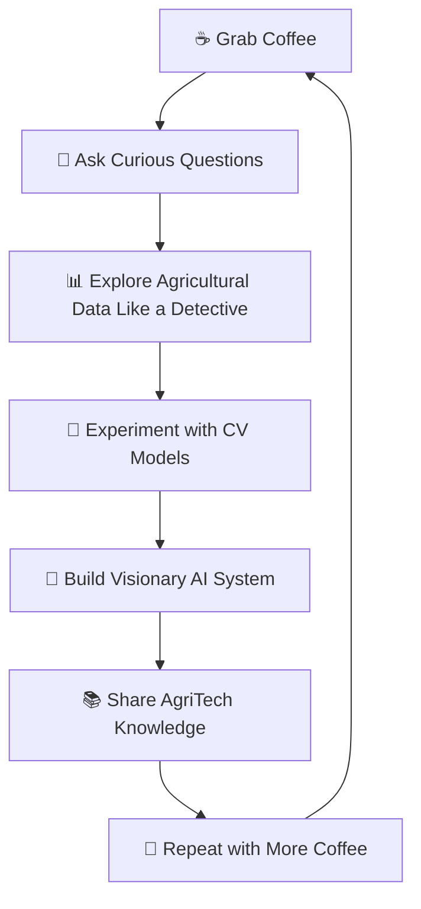

# <div align="center">🌌 Welcome to the Data Multiverse 🌌</div>

<div align="center">
  
  
  
  
  
</div>

---

<div align="center">

## 🚀 *"Turning Data into Magic, One Algorithm at a Time"* ✨
### *~ Aditya*

```ascii
     ╭─────────────────────────────────────────╮
     │  ░█████╗░██████╗░██╗████████╗██╗░░░██╗  │
     │  ██╔══██╗██╔══██╗██║╚══██╔══╝╚██╗░██╔╝  │
     │  ███████║██║░░██║██║░░░██║░░░░╚████╔╝░  │
     │  ██╔══██║██║░░██║██║░░░██║░░░░░╚██╔╝░░  │
     │  ██║░░██║██████╔╝██║░░░██║░░░░░░██║░░░  │
     │  ╚═╝░░╚═╝╚═════╝░╚═╝░░░╚═╝░░░░░░╚═╝░░░  │
     ╰─────────────────────────────────────────╯
```


</div>

---

<div align="center">

## 🎭 The Data Storyteller's Journey 🎭

</div>

<table>
  <tr>
    <td width="40%">
      
      
### 🌟 At a Glance
```yaml
name: Aditya Gupta
role: Data Alchemist 🧪 & AI Engineer
specialty: Transforming Raw Data → Golden Insights
based_in: India 🇮🇳
motto: "Every dataset has a secret to tell!"
current_obsession: Making AI more human-friendly
passion_project: Visionary - AI Agricultural Assistant
```

    </td>
    <td width="60%">

### 👋 Hello World! 

I'm **Aditya** - part detective 🕵️, part artist 🎨, and full-time data enthusiast! 

Think of me as a **digital archaeologist** who digs through mountains of data to uncover hidden treasures. Currently building **Visionary**, an AI-powered agricultural assistant that helps farmers detect crop diseases and analyze soil conditions.

**What makes me tick?** 
- 🧩 Solving complex puzzles that others find impossible
- 🌾 Building AI that helps farmers and agriculture
- 🚀 Creating scalable ML systems that actually work
- 📚 Learning something new every single day
- ☕ Converting caffeine into code at supernatural speeds

**Currently Working On:**
- 🔍 AI-powered crop disease detection (17+ diseases across 5 crops)
- 🌱 Computer vision for soil analysis
- ⚡ Real-time image processing with FastAPI & TensorFlow

    </td>
  </tr>
</table>

---

<div align="center">

### 🎯 My Superpower Matrix

<table>
  <tr>
    <td align="center">🔬<br><b>Data Science</b><br>████████████ 95%</td>
    <td align="center">🤖<br><b>Machine Learning</b><br>██████████░░ 90%</td>
    <td align="center">🐍<br><b>Python</b><br>███████████░ 92%</td>
    <td align="center">📊<br><b>Computer Vision</b><br>█████████░░░ 88%</td>
  </tr>
  <tr>
    <td align="center">🌐<br><b>FastAPI/React</b><br>██████████░░ 85%</td>
    <td align="center">🧠<br><b>TensorFlow</b><br>████████░░░░ 80%</td>
    <td align="center">🌾<br><b>AgriTech</b><br>███████░░░░░ 75%</td>
    <td align="center">☕<br><b>Coffee Brewing</b><br>████████████ 100%</td>
  </tr>
</table>

</div>

---

<div align="center">

### 🎪 The Three Acts of My Data Story

</div>

<table>
  <tr>
    <th width="33%">🎬 Act I: Discovery</th>
    <th width="33%">🎯 Act II: Innovation</th>
    <th width="33%">🚀 Act III: Impact</th>
  </tr>
  <tr>
    <td align="center">
      <br>
      <b>The Explorer Phase</b><br>
      🔍 Finding patterns in agricultural data<br>
      📈 Discovering crop disease signatures<br>
      🧪 Experimenting with CV techniques
    </td>
    <td align="center">
      <br>
      <b>The Creator Phase</b><br>
      🛠️ Building intelligent detection systems<br>
      ⚡ Optimizing ML algorithms for real-time<br>
      🎨 Crafting user-friendly interfaces
    </td>
    <td align="center">
      <br>
      <b>The Impactor Phase</b><br>
      🌍 Helping farmers optimize crop yields<br>
      💡 Sharing AgriTech knowledge<br>
      🤝 Contributing to open source
    </td>
  </tr>
</table>

---

<div align="center">

### 🎨 My Creative Process

</div>



---

<div align="center">

## 🛠️ Tech Arsenal & Magical Tools

</div>

### 🤖 Core Technologies & Languages


### 🧠 Machine Learning & AI Frameworks


### 🚀 Web Development & Frontend


### 📊 Data Science & Visualization


### 🌐 Development Tools & Platforms


---

## 🏆 Featured Project: Visionary 🌾

<div align="center">
  
### 🌱 *AI-Powered Agricultural Assistant* 🌱

[](https://github.com/adityagupta930/Visionary)

</div>

<table align="center">
<tr>
<td width="50%">

### 🎯 **Key Features**
- 🔍 **Disease Detection**: 17+ crop diseases across 5 major crops
- 🌱 **Soil Analysis**: AI-powered soil type classification  
- 📱 **User-Friendly**: Interactive React-based interface
- ⚡ **Real-Time**: Fast processing with TensorFlow models
- 🎯 **High Accuracy**: Precision-trained on extensive datasets

</td>
<td width="50%">

### 🏗️ **System Architecture**
- **Frontend**: React.js (Port 3000)
- **Crop Disease API**: FastAPI + TensorFlow (Port 8001)
- **Soil Analysis API**: FastAPI + TensorFlow (Port 8000)
- **ML Models**: Custom trained CNN models
- **Data Processing**: OpenCV + Pillow for image preprocessing

</td>
</tr>
</table>

### 🌾 **Supported Crops & Diseases**

| 🌽 **Corn** | 🥔 **Potato** | 🌾 **Rice** | 🎋 **Sugarcane** | 🌾 **Wheat** |
|-------------|---------------|-------------|------------------|---------------|
| Common Rust | Early Blight  | Brown Spot  | Bacterial Blight | Brown Rust    |
| Gray Leaf Spot | Late Blight | Leaf Blast  | Red Rot         | Yellow Rust   |
| Northern Leaf Blight | Healthy | Neck Blast | Healthy | Healthy |
| Healthy | | Healthy | | |

---

## 📊 GitHub Analytics Dashboard

<div align="center">
  
### 🎨 Contribution Constellation
  
```
         🌟 Every commit is a star in my coding galaxy 🌟
    
    ╭─────────────────────────────────────────────────────╮
    │  🚀 Building • Learning • Creating • Innovating    │  
    │     ░▒▓█ Contribution Graph Magic Below █▓▒░       │
    ╰─────────────────────────────────────────────────────╯
```

  

</div>

<div align="center">
  
  
  
</div>

<div align="center">
  
</div>

---

<div align="center">

## 🏆 GitHub Achievements

[](https://github.com/adityagupta930)

</div>

---

<div align="center">

## 🌐 Let's Connect & Collaborate!

<p>
<a href="https://www.linkedin.com/in/aditya-gupta-943b52243/"></a>
<a href="https://www.kaggle.com/adityagupta021103"></a>
<a href="https://www.hackerrank.com/profile/h210305124076"></a>
<a href="https://leetcode.com/u/aditya_gupta_02/"></a>
</p>

### 📧 **Business Inquiries**
[](mailto:h210305124076@gmail.com)

### 💌 Let's build something amazing together!

</div>

---

<div align="center">

## 🎨 Random Dev Wisdom


---

### 🌟 *"In the realm of data, every byte tells a story, every pattern reveals truth, and every model opens new possibilities!"*


```
⭐ Star my repos if you find them interesting!
🤝 Always open to exciting collaborations!
🌾 Passionate about AgriTech and AI!
☕ Powered by coffee and curiosity!
```

**Thanks for visiting! Keep coding, keep learning! 🚀✨**

</div>

---

<div align="center">

### 🎯 **Quick Project Access**

**Frontend**: `cd Front-End && npm start` (Port 3000)  
**Soil API**: `python -m uvicorn main_soil:app --port 8000 --reload`  
**Crop API**: `python -m uvicorn main_crop:app --port 8001 --reload`

**Profile Views:** 

</div>
