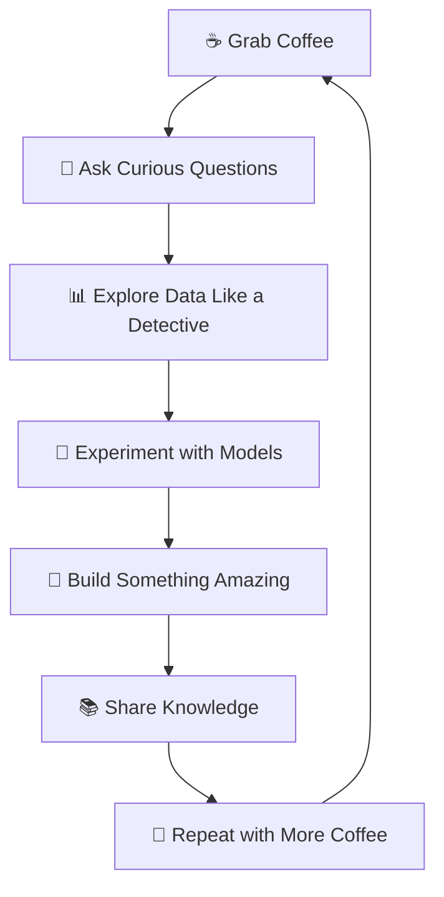

# <div align="center">🌌 Welcome to the Data Multiverse 🌌</div>

<div align="center">
  
  
  
  
  
</div>

---

<div align="center">

## 🚀 *"Turning Data into Magic, One Algorithm at a Time"* ✨

```ascii
     ╭─────────────────────────────────────────╮
     │  ░█████╗░██████╗░██╗████████╗██╗░░░██╗  │
     │  ██╔══██╗██╔══██╗██║╚══██╔══╝╚██╗░██╔╝  │
     │  ███████║██║░░██║██║░░░██║░░░░╚████╔╝░  │
     │  ██╔══██║██║░░██║██║░░░██║░░░░░╚██╔╝░░  │
     │  ██║░░██║██████╔╝██║░░░██║░░░░░░██║░░░  │
     │  ╚═╝░░╚═╝╚═════╝░╚═╝░░░╚═╝░░░░░░╚═╝░░░  │
     ╰─────────────────────────────────────────╯
```


</div>

---

<div align="center">

## 🎭 The Data Storyteller's Journey 🎭

</div>

<table>
  <tr>
    <td width="40%">
      
      
### 🌟 At a Glance
```yaml
name: Aditya Gupta
role: Data Alchemist 🧪
specialty: Transforming Raw Data → Golden Insights
based_in: India 🇮🇳
motto: "Every dataset has a secret to tell!"
current_obsession: Making AI more human-friendly
```

    </td>
    <td width="60%">

### 👋 Hello World! 

I'm **Aditya** - part detective 🕵️, part artist 🎨, and full-time data enthusiast! 

Think of me as a **digital archaeologist** who digs through mountains of data to uncover hidden treasures. Whether it's predicting customer behavior, optimizing business processes, or building smart AI systems, I love turning chaos into clarity.

**What makes me tick?** 
- 🧩 Solving complex puzzles that others find impossible
- 🚀 Building AI that actually makes sense (and works!)
- 📚 Learning something new every single day
- ☕ Converting caffeine into code at supernatural speeds

    </td>
  </tr>
</table>

---

<div align="center">

### 🎯 My Superpower Matrix

<table>
  <tr>
    <td align="center">🔬<br><b>Data Science</b><br>████████████ 95%</td>
    <td align="center">🤖<br><b>Machine Learning</b><br>██████████░░ 90%</td>
    <td align="center">🐍<br><b>Python</b><br>███████████░ 92%</td>
    <td align="center">📊<br><b>Visualization</b><br>█████████░░░ 88%</td>
  </tr>
  <tr>
    <td align="center">🗄️<br><b>SQL/Databases</b><br>██████████░░ 85%</td>
    <td align="center">☁️<br><b>Cloud Computing</b><br>████████░░░░ 80%</td>
    <td align="center">🌐<br><b>Web Tech</b><br>███████░░░░░ 75%</td>
    <td align="center">☕<br><b>Coffee Brewing</b><br>████████████ 100%</td>
  </tr>
</table>

</div>

---

<div align="center">

### 🎪 The Three Acts of My Data Story

</div>

<table>
  <tr>
    <th width="33%">🎬 Act I: Discovery</th>
    <th width="33%">🎯 Act II: Innovation</th>
    <th width="33%">🚀 Act III: Impact</th>
  </tr>
  <tr>
    <td align="center">
      <br>
      <b>The Explorer Phase</b><br>
      🔍 Finding patterns in chaos<br>
      📈 Discovering hidden insights<br>
      🧪 Experimenting with new techniques
    </td>
    <td align="center">
      <br>
      <b>The Creator Phase</b><br>
      🛠️ Building intelligent systems<br>
      ⚡ Optimizing algorithms<br>
      🎨 Crafting beautiful visualizations
    </td>
    <td align="center">
      <br>
      <b>The Impactor Phase</b><br>
      🌍 Solving real-world problems<br>
      💡 Sharing knowledge with community<br>
      🤝 Mentoring aspiring data scientists
    </td>
  </tr>
</table>

---

<div align="center">

### 🎨 My Creative Process

</div>



---

<div align="center">

### 🎪 Fun Facts That Make Me... Me!

| 🌟 **Quirky** | 🎯 **Professional** | 🚀 **Ambitious** |
|:-------------:|:-------------------:|:-----------------:|
| I name my variables after Marvel characters | I've built models that predict pizza delivery times | Working on AI that can understand dad jokes |
| Can spot data anomalies faster than typos | Automated my morning routine (except coffee making) | Goal: Make AI accessible to everyone |
| My idea of relaxation is cleaning datasets | Love explaining complex ML concepts simply | Dream: Contributing to breakthrough AI research |

</div>

---

<div align="center">

### 💭 My Current Mindset

> *"I believe that the best data scientists are not just statisticians or programmers - they are storytellers who happen to speak fluent Python. Every dataset is a book waiting to be read, every algorithm is a tool waiting to be wielded, and every insight is a story waiting to be told."*

**🎯 Mission**: To bridge the gap between complex AI and human understanding, one project at a time.

</div>

---

<div align="center">

## 🛠️ My Tech Arsenal

### 🤖 AI/ML Powerhouse


### 📊 Data Visualization Magic


### 🗄️ Database Mastery


### 🌐 Web Technologies


</div>

---

## 📊 GitHub Analytics Dashboard

<div align="center">
  
  
  
</div>

<div align="center">
  
</div>

<div align="center">
  
</div>

---

<div align="center">

## 🏆 GitHub Achievements

[](https://github.com/adityagupta930)

</div>

---

## 🚀 Current Projects & Focus

<table>
  <tr>
    <td width="50%">
      
### 🔮 What I'm Working On
```yaml
current_projects:
  - name: "Smart Analytics Platform"
    tech: ["Python", "TensorFlow", "React"]
    status: "🚧 In Development"
    
  - name: "ML Model Optimization"
    tech: ["Scikit-learn", "Docker"]
    status: "🔬 Research Phase"
    
  - name: "Data Pipeline Automation"
    tech: ["Python", "MongoDB", "AWS"]
    status: "✅ MVP Ready"
```

    </td>
    <td width="50%">
      
### 🎯 Learning Journey
```yaml
currently_learning:
  - "🤖 Generative AI & LLMs"
  - "☁️ MLOps & Model Deployment"
  - "📊 Advanced Deep Learning"
  - "🔐 AI Ethics & Responsible AI"
  
next_goals:
  - "🎓 AI Research Publication"
  - "🌟 Open Source Contributions"
  - "🏆 Kaggle Grandmaster"
```

    </td>
  </tr>
</table>

---

<div align="center">

## 🌐 Let's Connect & Collaborate!

<p>
<a href="https://www.linkedin.com/in/aditya-gupta-943b52243/"></a>
<a href="https://www.kaggle.com/adityagupta021103"></a>
<a href="https://www.hackerrank.com/profile/h210305124076"></a>
<a href="https://leetcode.com/u/aditya_gupta_02/"></a>
</p>

### 💌 Let's build something amazing together!

</div>

---

<div align="center">

## 🎨 Random Dev Wisdom


---

### 🌟 *"In the realm of data, every byte tells a story, every pattern reveals truth, and every model opens new possibilities!"*


```
⭐ Star my repos if you find them interesting!
🤝 Always open to exciting collaborations!
☕ Powered by coffee and curiosity!
```

**Thanks for visiting! Keep coding, keep learning! 🚀✨**

</div>
