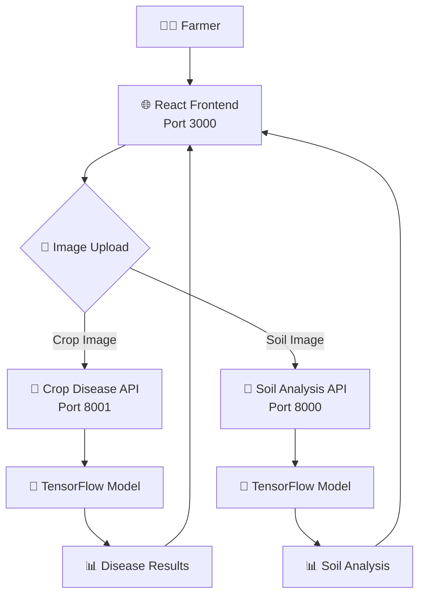

# <div align="center">🌾 Visionary - AI-Powered Agricultural Assistant 🌾</div>

<div align="center">
  
  
  
  
  
</div>

---

<div align="center">

## 🚀 *"Transforming Agriculture with AI - One Crop at a Time"* ✨

</div>

## 🌟 About Visionary

**Visionary** is a cutting-edge agricultural AI system that helps farmers detect crop diseases and analyze soil types using deep learning and computer vision. Built with modern web technologies, it provides real-time analysis and actionable insights for better farming decisions.

### 🎯 Key Features
- 🔍 **Disease Detection**: Identifies 17+ crop diseases across 5 major crops
- 🌱 **Soil Analysis**: Advanced soil type classification using AI
- 📱 **User-Friendly Interface**: Interactive React-based web application
- ⚡ **Real-Time Processing**: Fast API responses with TensorFlow models
- 🎯 **Accurate Predictions**: High-precision AI models trained on extensive datasets

---

## 🛠️ Tech Stack

<div align="center">

### 🎨 Frontend


### 🤖 Backend & AI


### 📊 Data & Tools


</div>

---

## ⚡ Quick Start

### Prerequisites
- 🐍 Python 3.8+
- 📦 Node.js & npm
- 🔧 Git

### 🚀 Installation and Running

**1. Frontend Setup:**
```bash
cd Front-End
npm install
npm start
```

**2. Backend Setup:**
```bash
cd Back-End
pip install -r requirements.txt
```

**3. Start APIs:**
```bash
# Soil Analysis API (Port 8000)
cd Crop
python -m uvicorn main_soil:app --host 0.0.0.0 --port 8000 --reload

# Crop Disease API (Port 8001)
cd Crop
python -m uvicorn main_crop:app --host 0.0.0.0 --port 8001 --reload
```

---

## 📋 System Architecture

<div align="center">


```mermaid
flowchart TD
    A[👨‍🌾 Farmer] --> B[🌐 React Frontend<br/>Port 3000]
    B --> C{📸 Image Upload}
    C -->|Crop Image| D[🌾 Crop Disease API<br/>Port 8001]
    C -->|Soil Image| E[🌱 Soil Analysis API<br/>Port 8000]
    D --> F[🤖 TensorFlow Model]
    E --> G[🤖 TensorFlow Model]
    F --> H[📊 Disease Results]
    G --> I[📊 Soil Analysis]
    H --> B
    I --> B
```

</div>

### 🏗️ Components
- **Frontend**: React.js application (Port 3000)
- **Crop Disease API**: FastAPI + TensorFlow (Port 8001)
- **Soil Analysis API**: FastAPI + TensorFlow (Port 8000)

---

## 🌾 Supported Crop Diseases

<div align="center">

| 🌽 **Corn** | 🥔 **Potato** | 🌾 **Rice** | 🎋 **Sugarcane** | 🌾 **Wheat** |
|-------------|---------------|-------------|------------------|---------------|
| Common Rust | Early Blight  | Brown Spot  | Bacterial Blight | Brown Rust    |
| Gray Leaf Spot | Late Blight | Leaf Blast  | Red Rot         | Yellow Rust   |
| Northern Leaf Blight | Healthy | Neck Blast | Healthy | Healthy |
| Healthy | | Healthy | | |

**Total: 17 Disease Categories Detected** 🎯

</div>

---

## 📖 Detailed Setup Guide

### 🎯 What You'll Learn

<table>
  <tr>
    <td width="50%">
      
**🔧 Technical Setup**
- Complete prerequisites installation
- Step-by-step configuration
- Virtual environment setup
- Dependency management
- Port configuration
      
    </td>
    <td width="50%">
      
**🚀 System Operation**
- Running 3 services simultaneously
- Testing with sample images
- API endpoint usage
- Troubleshooting common issues
- Performance optimization
      
    </td>
  </tr>
</table>

### 🌟 What You'll Build
- 🖥️ Interactive web interface for farmers
- 🤖 AI-powered disease detection system
- 🌱 Soil analysis and classification tool
- 📊 Real-time results and recommendations

**📚 [Complete Setup Guide →](./DETAILED_SETUP_GUIDE.md)**

---

## 🎮 How to Use

<div align="center">

### 🔄 Simple 4-Step Process

```
📱 Upload Image → 🤖 AI Analysis → 📊 Get Results → 💡 Take Action
```

</div>

1. **🚀 Start Services**: Run all 3 components (Frontend + 2 APIs)
2. **🌐 Open Browser**: Navigate to `http://localhost:3000`
3. **📸 Upload Images**: Select crop or soil photos for analysis
4. **📊 View Results**: Get instant AI-powered insights and recommendations

---

## 📚 Documentation

<div align="center">

| 📖 **Guide** | 🎯 **Purpose** | 🔗 **Link** |
|--------------|----------------|-------------|
| Setup Guide | Complete installation instructions | [DETAILED_SETUP_GUIDE.md](./DETAILED_SETUP_GUIDE.md) |
| Full Documentation | Technical specs & API details | [DOCUMENTATION.md](./DOCUMENTATION.md) |
| Model Training | Jupyter notebooks for AI models | `NoteBook/` directory |

</div>

---

<div align="center">

## 🤝 Connect & Collaborate

[](https://www.linkedin.com/in/aditya-gupta-943b52243/)
[](https://www.kaggle.com/adityagupta021103)
[](https://www.hackerrank.com/profile/h210305124076)
[](https://leetcode.com/u/aditya_gupta_02/)

### 💭 *"Technology should serve humanity, and agriculture feeds humanity"*


**⭐ Star this repo if you find it helpful!**
**🤝 Contributions and feedback are always welcome!**

</div>
